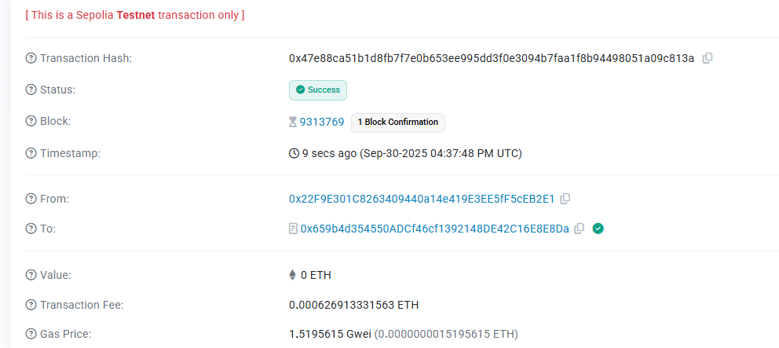

# Anonymous Cultural Crowdfunding

A privacy-preserving crowdfunding platform for cultural projects built on Fully Homomorphic Encryption (FHE) technology. This decentralized application enables creators to raise funds for cultural initiatives while maintaining complete anonymity for both project creators and contributors.

## 🌟 Overview

Anonymous Cultural Crowdfunding revolutionizes the way cultural projects are funded by leveraging cutting-edge FHE smart contracts. The platform ensures that contribution amounts remain encrypted on-chain, protecting the privacy of backers while maintaining full transparency of project operations.

## 🔐 Core Concepts

### Fully Homomorphic Encryption (FHE)

This platform utilizes FHE technology to enable computations on encrypted data without ever decrypting it. This means:

- **Private Contributions**: Donation amounts are encrypted end-to-end, visible only to the contributor
- **Confidential Fundraising**: Project funding progress is calculated on encrypted values
- **Anonymous Backing**: Contributors can support projects without revealing their identity or contribution amount publicly
- **Trustless Privacy**: No central authority can access private contribution data

### Privacy-First Architecture

The platform implements a zero-knowledge architecture where:
- Contribution amounts are encrypted using FHE before being recorded on-chain
- Smart contracts perform calculations on encrypted values without decryption
- Only authorized parties (the contributor themselves) can decrypt their contribution amounts
- Project creators receive funds without knowing individual contribution amounts

### Cultural Project Categories

Support diverse cultural initiatives across multiple categories:
- 🎨 Visual Arts
- 🎵 Music
- 📚 Literature
- 🎬 Film & Cinema
- 🎭 Theater & Performance
- 💃 Dance
- 🖥️ Digital Art
- 📸 Photography
- 🏺 Traditional Crafts
- 🏛️ Community Cultural Heritage

## 🚀 Features

### For Project Creators

- **Launch Cultural Projects**: Create crowdfunding campaigns with customizable funding goals and timelines
- **Privacy Options**: Choose between public or anonymous project creation
- **Flexible Funding Periods**: Set campaigns from 1 week to 3 months
- **Automatic Fund Distribution**: Receive funds automatically upon successful campaign completion
- **Real-time Analytics**: Track backer count and campaign progress without compromising privacy

### For Contributors

- **Anonymous Donations**: Support projects with complete privacy protection
- **Encrypted Contributions**: Your donation amount is encrypted and private
- **Support Messages**: Leave anonymous messages of encouragement for creators
- **Refund Protection**: Automatic refunds if projects don't meet their funding goals
- **Multi-Project Support**: Back multiple cultural initiatives simultaneously

### Smart Contract Features

- **FHE-Powered Privacy**: All sensitive data encrypted using Fully Homomorphic Encryption
- **Automated Finalization**: Projects automatically conclude when funding period ends
- **Secure Fund Management**: Encrypted balance tracking and secure withdrawals
- **Refund Mechanism**: Built-in refund system for unsuccessful campaigns
- **Emergency Controls**: Safety mechanisms for edge cases

## 📋 Smart Contract

**Contract Address**: `0x659b4d354550ADCf46cf1392148DE42C16E8E8Da`

The smart contract is deployed on a privacy-focused blockchain network and handles:
- Project creation and management
- Encrypted contribution processing
- Funding goal verification on encrypted data
- Automated fund distribution
- Secure refund processing

## 🎬 Demo & Documentation

### Live Demo
Experience the platform: [https://anonymous-cultural-crowdfunding.vercel.app/](https://anonymous-cultural-crowdfunding.vercel.app/)

### Video Demonstration AnonymousCulturalCrowdfunding.mp4
Watch our demo video showcasing:
- Creating a cultural project
- Making anonymous contributions
- FHE encryption in action
- Project finalization and fund withdrawal

### On-Chain Transaction Examples

View recent transactions on the blockchain explorer to see:
- Encrypted contribution events
- Project creation transactions
- Fund withdrawal confirmations
- Privacy-preserving operations

## 💡 How It Works

### Creating a Project

1. Connect your Web3 wallet to the platform
2. Navigate to the "Create Project" tab
3. Fill in project details:
   - Project title and description
   - Cultural category
   - Funding target (in ETH)
   - Campaign duration
   - Optional IPFS metadata hash for additional materials
4. Submit transaction to create your project on-chain

### Contributing to Projects

1. Browse active cultural projects
2. Select a project you wish to support
3. Enter contribution amount (encrypted automatically)
4. Optionally add an anonymous support message
5. Confirm transaction to submit your encrypted contribution

### Project Finalization

- Projects automatically finalize when the funding period expires
- FHE smart contract verifies if encrypted funding goal was met
- Successful projects: Creators can withdraw funds
- Unsuccessful projects: Contributors can claim automatic refunds

## 🛡️ Security & Privacy

### Encryption Standards

- Industry-leading FHE implementation
- End-to-end encryption for all sensitive data
- On-chain encrypted storage
- No plaintext exposure of contribution amounts

### Audit & Safety

- Smart contract security best practices
- Emergency pause functionality
- Reentrancy protection
- Input validation and bounds checking

### Privacy Guarantees

- **Contributor Privacy**: Donation amounts remain encrypted
- **Selective Disclosure**: Users control what information to reveal
- **No Central Authority**: Decentralized architecture ensures no single point of failure
- **Immutable Records**: Blockchain permanence with privacy preservation

## 🌐 Technology Stack

- **Smart Contracts**: Solidity with FHE libraries
- **Frontend**: Vanilla JavaScript with Web3 integration
- **Blockchain Interaction**: ethers.js v5
- **Encryption**: Fully Homomorphic Encryption (FHE)
- **Storage**: IPFS for extended project materials
- **Deployment**: Vercel for frontend hosting

## 📊 Platform Statistics

Track the growth of cultural funding:
- Total projects launched
- Active crowdfunding campaigns
- Successfully funded initiatives
- Total cultural community members

## 🤝 Community & Support

### Contributing

We welcome contributions from developers, artists, and privacy advocates. Check our GitHub repository for:
- Open issues and feature requests
- Development guidelines
- Community discussions

**GitHub Repository**: [https://github.com/your-username/fhevm-react-template](https://github.com/your-username/fhevm-react-template)

### Support the Movement

Join us in revolutionizing cultural project funding through privacy-preserving technology. Whether you're a creator seeking support or a patron of the arts, Anonymous Cultural Crowdfunding provides the tools for confidential, secure, and transparent cultural funding.

## 📜 License

This project is open-source and available under the MIT License.

## 🔗 Links

- **Live Platform**: [https://anonymous-cultural-crowdfunding.vercel.app/](https://anonymous-cultural-crowdfunding.vercel.app/)

- **Smart Contract**: `0x659b4d354550ADCf46cf1392148DE42C16E8E8Da`

---

**Built with ❤️ for cultural creators and privacy advocates worldwide**

*Empowering cultural expression through privacy-preserving blockchain technology*
